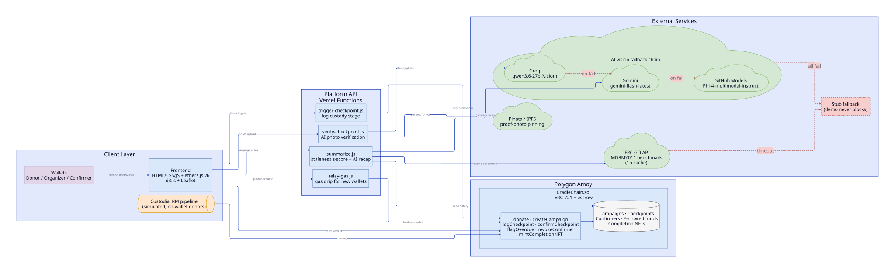
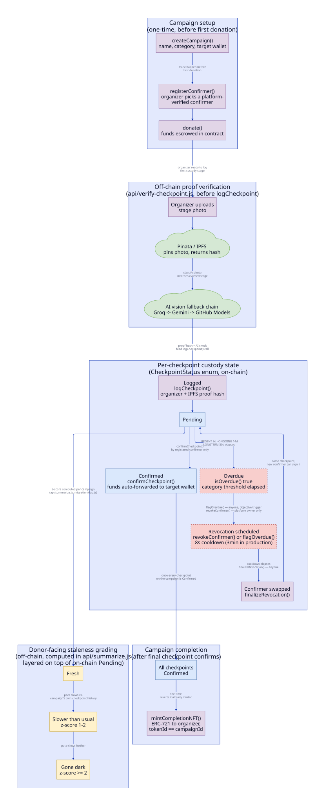
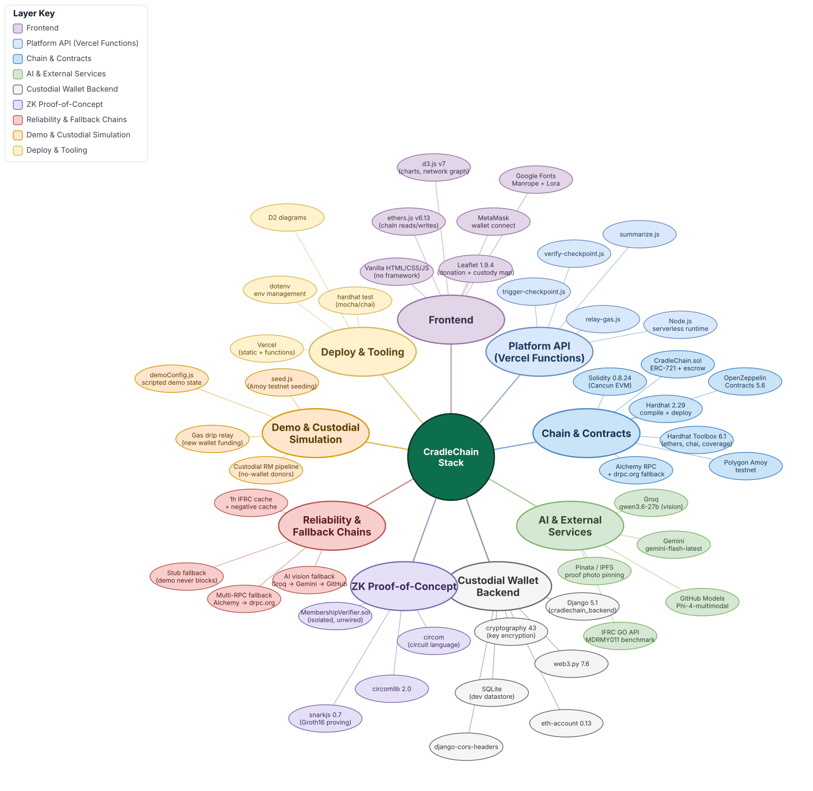

# CradleChain

## Inspiration

My inspiration comes from a fish ladder, a structure engineers built when a dam blocks a river.
Instead of a wall the fish cannot pass, the dam gets a staircase of small pools. The fish climbs
one pool at a time, and each gate opens only when it is safe to let the fish through, in plain
view of anyone standing on the bank.

I wonder why donations do not move the same way. Every year during floods and disasters,
Malaysians give generously, but the money often disappears somewhere between the donor and the
people who need it, sitting in one account nobody outside can check. CradleChain moves every
donation like that fish climbing the ladder. It lands in the first pool the moment you give, a
verified confirmer opens the gate before it can move to the next stage, and every step is stamped
onto the blockchain. Anyone can see exactly which pool a donation is in and every gate it already
passed through, until it reaches the people it was meant for.

## What it does

CradleChain proves that a Malaysian NGO's fund disbursement was independently checked before the
money moved, not just recorded after the fact. It is a blockchain-verified micro-donation
chain-of-custody system built for Malaysian donors and NGOs.

- A donor gives to a campaign; the funds are held in escrow by the smart contract, not sent
  anywhere yet.
- The organizer logs each disbursement stage as a checkpoint, with a photo as evidence.
- A pre-vetted, platform-bonded confirmer, a separate party from the organizer, has to sign off
  on that checkpoint before the escrowed funds actually move.
- An AI check independently reviews the evidence photo against the claimed stage as an advisory
  second opinion, visible to anyone browsing the campaign.
- Donors without a crypto wallet can sign up with just an email and password; the backend
  creates and custodies a real wallet for them and signs their donation transactions.

**Live demo:** https://cradle-chain.vercel.app

## For judges, thirty seconds to verify

No wallet needed. Open the live demo, go to **Donate**, pick any campaign, and click **Trigger
live checkpoint**. This fires a real, server-signed transaction on Polygon Amoy. Watch it land in
that campaign's funds tracker on the detail page a few seconds later. A full walkthrough is in
[`docs/judge-testing-guide.md`](docs/judge-testing-guide.md).

## How the system fits together

The contract escrows every donation until its checkpoint is confirmed. A checkpoint's status
moves from pending to confirmed only when the campaign's registered confirmer signs it on-chain.

## Trust model

CradleChain is a permissioned, two-party attestation system, not a trustless oracle. An organizer
registers a pre-vetted confirmer from the platform's own allowlist before any donations arrive,
and every checkpoint the organizer logs stays pending until that same confirmer signs it. This
proves a named, vetted second party attested that a stage occurred. It is not proof the money was
spent well, but it is a real second layer of scrutiny, and the AI evidence check narrows that gap
further without closing it.

## Deployed contract

- Network: Polygon Amoy testnet
- Address: `0x7f22b45852F66C3eFDECC0C6AcB1D17729787da0`

## Tech stack

Solidity, Hardhat, and OpenZeppelin for the contract. Plain HTML, CSS, and JavaScript for the
frontend, no build tools. Vercel serverless functions for the API layer, with a fallback chain
across Groq, Gemini, and GitHub Models for the AI evidence check. Django, deployed on Render,
for the custodial-wallet backend. A standalone zero-knowledge proof of concept lives under `zk/`.

## Setup

1. `npm install`
2. Copy `.env.example` to `.env` and fill in `ALCHEMY_AMOY_URL` and `DEPLOYER_PRIVATE_KEY`.
3. `npx hardhat test` to run the contract test suite.
4. `npx hardhat run scripts/deploy.js --network amoy` to deploy and regenerate
   `frontend/js/contractDeployment.json`.
5. Copy `frontend/js/pinataConfig.example.js` to `frontend/js/pinataConfig.js` and fill in a
   Pinata JWT.
6. Set `GROQ_API_KEY`, `GEMINI_API_KEY`, `DEMO_ORGANIZER_PRIVATE_KEY`,
   `DEMO_CONFIRMER_PRIVATE_KEY`, and `ALCHEMY_AMOY_URL` as environment variables for the API
   functions.
7. `npx vercel dev` to serve the frontend and API functions together.

### Custodial backend (email/password donations, optional to run locally)

1. `cd backend && python -m venv venv && venv\Scripts\activate` (or `source venv/bin/activate`
   on macOS/Linux), then `pip install -r requirements.txt`.
2. Copy `backend/.env.example` to `backend/.env` and fill in `DJANGO_SECRET_KEY`,
   `WALLET_ENCRYPTION_KEY`, `AMOY_RPC_URL`, and `RELAYER_PRIVATE_KEY` (a funded Amoy wallet that
   signs custodial donations on donors' behalf).
3. `python manage.py migrate`, then `python manage.py runserver 127.0.0.1:8000`.
4. Live deployment runs this on Render (`gunicorn cradlechain_backend.wsgi:application`), with
   `frontend/js/backendAuth.js`'s `API_BASE` pointed at the deployed Render URL.

## Known limitations

- Nothing structurally prevents an organizer and their registered confirmer from being the same
  real-world party. The AI evidence check narrows this gap, but the next step is requiring
  confirmers to be independently vetted third parties, and considering a second confirmer for
  larger donations.
- The custodial, no-wallet donation pipeline in `backend/` is deployed on Render and live on the
  production site. It has no email verification step, so a signed-up donor's wallet is only as
  trustworthy as the email address they typed in.
- RM to POL conversion only runs one way today: a custodial donor's RM input is converted to POL
  before it hits the chain (`rm_to_wei()` in `backend/wallets/chain.py`). Campaign totals and
  history are always displayed in raw POL, never converted back to RM, so a donor who thinks in
  RM has no RM-denominated view of where their money stands. Two different, uncoordinated
  conversion rates exist in the codebase in the meantime (`RM_PER_POL_RATE=2.50` in
  `backend/.env`, `MATIC_TO_RM = 3.2` in `frontend/js/gasWidget.js`), which would need to become
  one shared source before a POL-to-RM display could be trusted.
- `slashConfirmer` exists on-chain to strip a misbehaving confirmer's stake and allowlist status,
  but nothing calls it automatically today. The next step is tying it to on-chain evidence, such
  as a confirmer's unconfirmed-checkpoint streak crossing the overdue threshold, so misbehavior
  gets flagged without relying on a person noticing.

