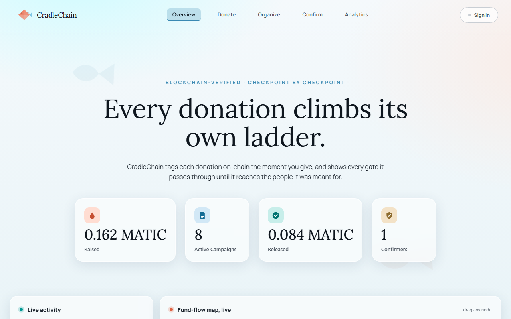
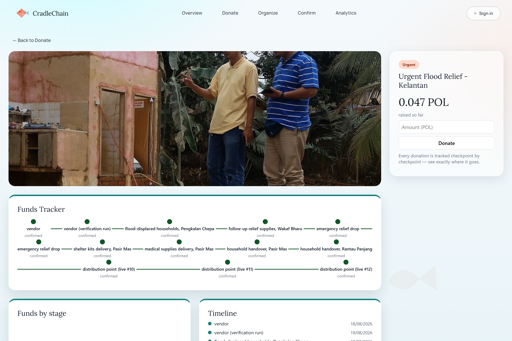
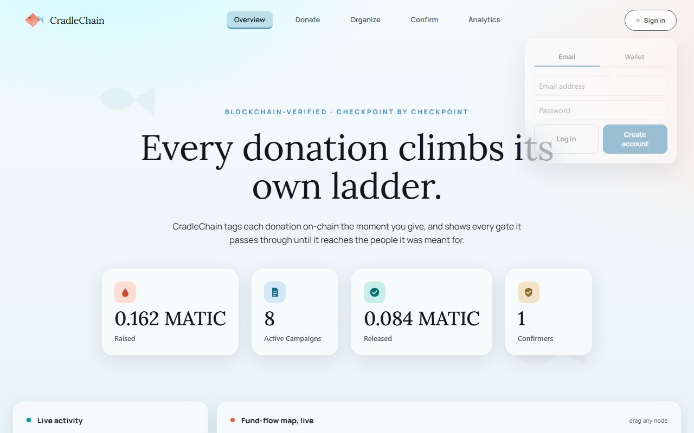
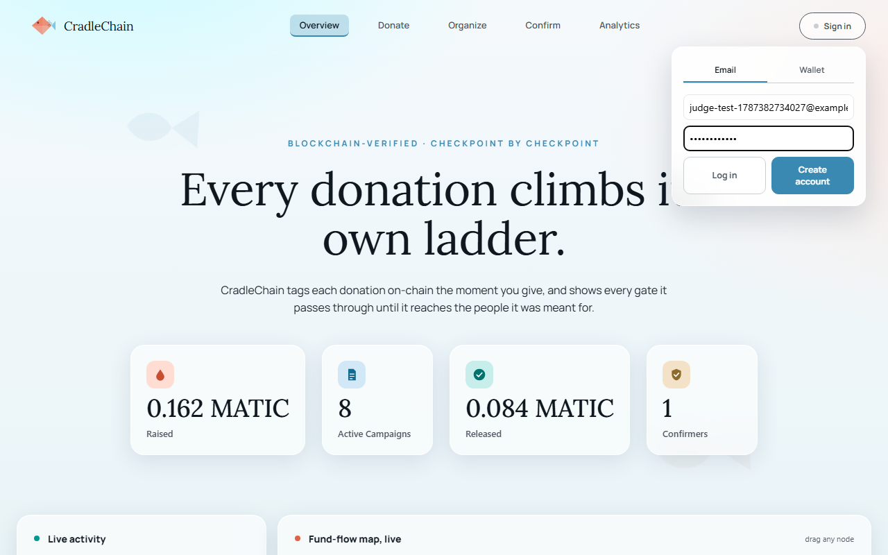
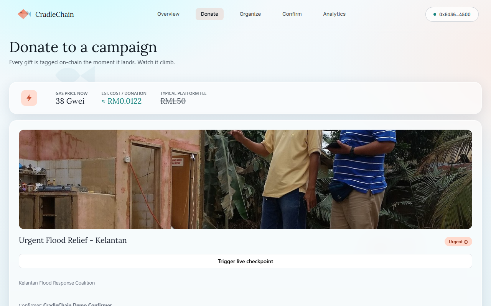
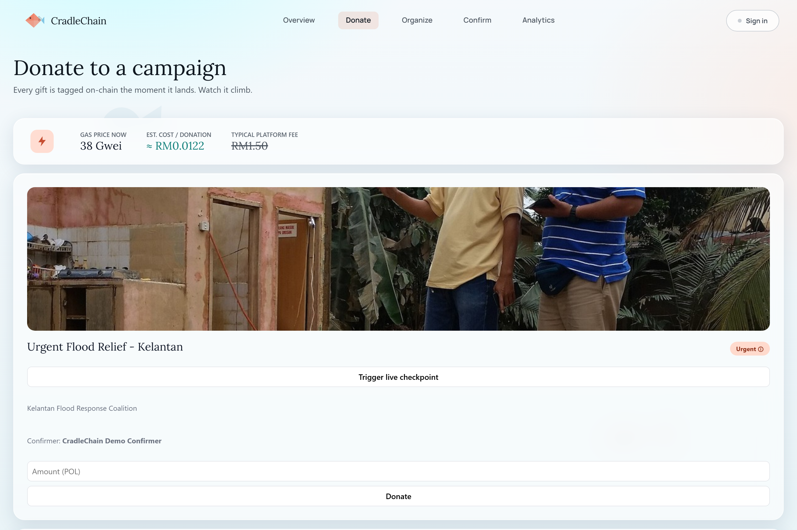
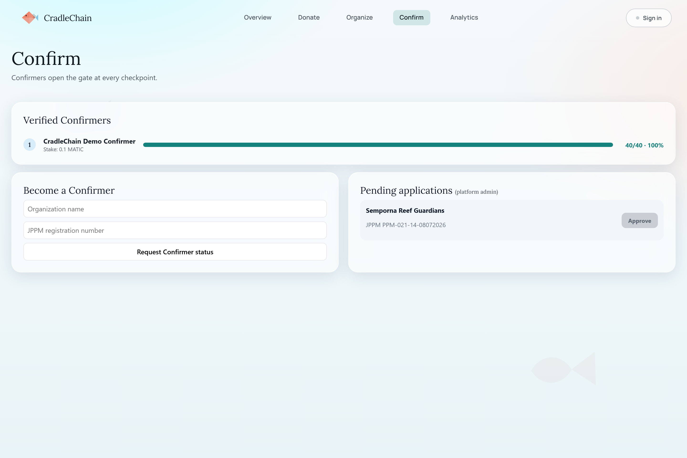
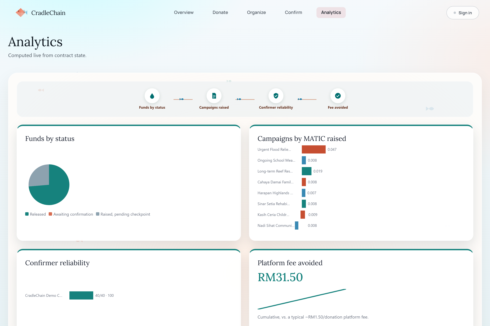

# Judge Testing Guide

Thank you for taking the time to try CradleChain. No crypto wallet is required to browse,
and none is required to donate either, see Step 3. MetaMask is only needed for the optional
admin checks in the last step.

## Before you start

Please ask whoever is running the demo for the URL, and whether the 3 seeded campaigns
are live on-chain for this session. If they are, you will see real data. If a campaign
shows a "Demo data, connect a wallet" notice, you are looking at fallback data instead,
please see the last section before judging anything off it.

## Step 1, Overview page

Please open the app. You will land on Overview. Take a look at the four stat cards, the
live activity feed, and the fund-flow map. This page alone should tell you what the
product does before you click anything.

## Step 2, Browse a campaign

Please click Donate, then open any campaign card. On the detail page you will find the
5W1H block (fixed, pre-written copy, not AI-generated), the checkpoint timeline, and an
AI summary card. Feel free to click Generate AI summary to fetch a real, on-demand
summary of that campaign's pace and confirmer track record.

## Step 3, Donate without a wallet

Click **Sign in** at the top right, then the **Email** tab, then **Create account**. Any
email and an 8+ character password works, nothing is verified. This creates a real wallet
for you behind the scenes, funded and held by the platform. Now donate to any campaign, no
MetaMask popup, no seed phrase, just an amount and a click. This is CradleChain's answer to
"most Malaysians don't have a crypto wallet": the chain-of-custody guarantees still apply,
the donor just never has to touch a wallet.

  
  
  

## Step 4, Trigger a live checkpoint

On a real campaign card, please click Trigger live checkpoint. This fires a real,
server-signed transaction on Polygon Amoy, no wallet needed. Please watch the checkpoint
count update, then generate the AI summary again to see it reflect the new data.

## Step 5, Confirmers and Analytics

The Confirm page shows the confirmer allowlist, and the Analytics page shows aggregate
charts across all campaigns. Both are read-only, so please feel free to explore freely.

  
  

## Step 6, Optional, needs MetaMask

If you would like to go further, these two checks test the contract's permission logic
directly:
- Try confirming a checkpoint from a wallet that is not the registered confirmer. It
  should revert.
- Try registering a confirmer address that is not on the platform's allowlist. It should
  also revert.

Please feel free to skip this step if you would rather not set up MetaMask.

## Real vs demo data

The AI summary text is specific and changes after you trigger a live checkpoint (Step
3). If it stays the same no matter what you click, or a "Demo data" notice is shown,
you are looking at fallback data, most often caused by the free public RPC this project
runs on rate-limiting under load, not a broken feature. Please flag it to whoever is
running the demo, and thank you again for your patience.
